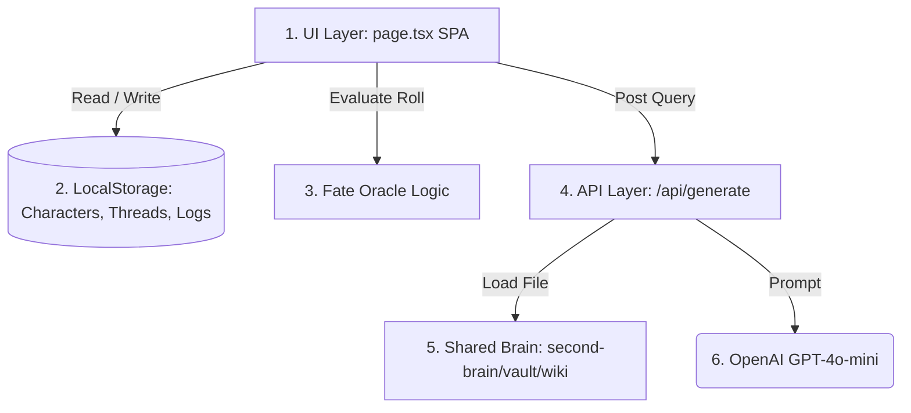

# App Architecture

The **Mythic GM Emulator (AI Upgrade)** is built as a single-page Next.js application designed to run locally or as a server-rendered dashboard. It manages campaign states client-side while utilizing OpenAI endpoints for atmospheric storytelling.

---

## 🏗️ System Components

1.  **Frontend SPA Layout (`src/app/page.tsx`):**
    *   Unified dashboard using **Tailwind CSS v4** and **Shadcn UI** components.
    *   Premium Dark Fantasy aesthetic featuring parchment/stone colors and glowing runic styling.
2.  **Client-Side Persistence (LocalStorage):**
    *   Tracks characters, plot threads, scene lists, campaign logs, active settings, and custom API keys.
3.  **Local Rule Emulator:**
    *   Rolls local dice (1d100 for Fate Chart, 1d10 for Scene Start).
    *   Evaluates answers, exceptional results, and random event triggers.
4.  **OpenAI Generation Endpoint (`src/app/api/generate/route.ts`):**
    *   Acts as the GM, interpreting mechanical roll results into atmospheric narrative prose.
5.  **Cross-Repository Shared Lore Integration:**
    *   Directly imports files from the **Stash Second Brain** (`second-brain/vault/wiki`) to inject campaign world history into the AI prompt context.

---

## 🐛 Identified Logic Bugs

During the architecture review, the following logic differences from the **Mythic GME 2e** rules were identified in `src/app/page.tsx`:

### 1. Random Event Threshold Bug
- **Code:** `roll % 11 === 0 && (roll / 11) < chaosFactor` (Line 486).
- **Rule:** A double-digit roll (e.g. 55) triggers an event if the single-digit value (5) is $\le$ the Chaos Factor.
- **Impact:** Double rolls equal to the Chaos Factor (e.g., rolling 55 at Chaos 5) fail to trigger random events.
- **Fix:** Update operator to `<=`.

### 2. Exceptional Results Approximation
- **Code:** `isExceptionalYes = roll < (threshold / 5)` and `isExceptionalNo = roll >= (threshold / 5 + 81)`.
- **Rule:** 2nd Edition uses a hard-coded column reference on the Fate Chart (e.g. for a threshold of 10 at Chaos 1, the Exceptional Yes limit is 2, and Exceptional No is 83).
- **Fix:** Map the exact 2e Fate Chart tables into `src/lib/constants.ts` to replace these 1e-based mathematical approximations.

---

## 🔗 Connections
- [[index]] — Knowledge base map.
- [[rules-summary]] — High-level Mythic mechanics.
- [[ai-oracle-prompting]] — How LLMs parse campaign context.
