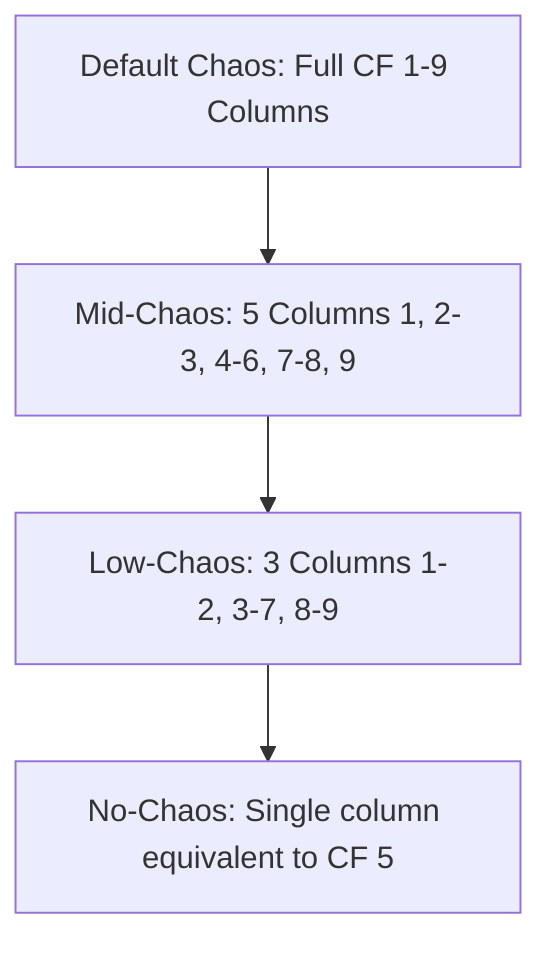

# Chaos Factor

The **Chaos Factor** is a core metric in Mythic GME that tracks how out-of-control the current adventure has become. It acts as a dynamic slider, adjusting the probability of unexpected twists and affirmative answers based on recent events.

---

## ⚙️ Core Mechanics

### 1. Scaling Range
- The Chaos Factor exists as a integer value from **1 to 9**.
- A new adventure always begins with the Chaos Factor set to **5**.

### 2. Changing the Chaos Factor
At the end of every scene (during **End of Scene Bookkeeping**), the player adjusts the Chaos Factor:
- **Decrease (-1):** If the Player Characters (PCs) were mostly in control of the situation during the scene. (Minimum limit: 1).
- **Increase (+1):** If the PCs were mostly not in control, reacting to circumstances, or facing significant setbacks. (Maximum limit: 9).

---

## ⚡ Rule Effects of the Chaos Factor

The value of the Chaos Factor alters three main areas of play:

### 1. Yes/No Probability Shifts
On the **Fate Chart**, a higher Chaos Factor increases the Yes/Exceptional Yes thresholds. For example, at `50/50` Odds:
- At **Chaos Factor 1**: Yes threshold is **10%** (Low probability).
- At **Chaos Factor 5**: Yes threshold is **50%** (Even probability).
- At **Chaos Factor 9**: Yes threshold is **90%** (High probability).

For **Fate Checks** (2d10), the Chaos Factor modifier ranges from `-5` (CF 1) to `+5` (CF 9).

### 2. Random Event Frequencies
Random Events trigger on double rolls matching the Chaos Factor:
- **Fate Chart (1d100):** A double-digit roll (e.g. 33) triggers a Random Event if the single-digit value (3) is $\le$ Chaos Factor.
- **Fate Check (2d10):** A double-die roll (e.g. 4 and 4) triggers a Random Event if that number (4) is $\le$ Chaos Factor.
- *Result:* High Chaos factors (e.g. 8 or 9) trigger random events on almost any double, while Low Chaos factors (e.g. 1 or 2) make random events extremely rare.

### 3. Expected Scene Modifications
When testing a new scene:
- The player rolls 1d10.
- If the roll is $\le$ Chaos Factor:
  - If **Odd** (1, 3, 5, 7, 9): The scene is **Altered**.
  - If **Even** (2, 4, 6, 8): The scene is **Interrupted** (Random Event).

---

## 🌀 Chaos Flavors (Variations)

If you prefer the Chaos Factor to have a milder impact on Fate Questions, you can choose one of the following variant structures at the start of your adventure:

### 1. Mid-Chaos
Tones down the extreme ranges of Chaos by grouping columns:
- **Fate Chart Columns:** `1`, `2–3`, `4–6` (Default/None), `7–8`, `9`
- **Fate Check Modifiers:**
  - CF 9: `+2`
  - CF 7–8: `+1`
  - CF 4–6: `None`
  - CF 2–3: `-1`
  - CF 1: `-2`

### 2. Low-Chaos
Allows only very minor influence:
- **Fate Chart Columns:** `1–2`, `3–7` (Default/None), `8–9`
- **Fate Check Modifiers:**
  - CF 8–9: `+1`
  - CF 3–7: `None`
  - CF 1–2: `-1`

### 3. No-Chaos
The Chaos Factor is completely ignored:
- **Fate Chart:** Uses only the equivalent of the CF 5 column.
- **Fate Check:** Modifiers from Chaos Factor are never applied (`+0`).

---

## 🔗 Connections
- [[index]] — Knowledge base map.
- [[fate-questions]] — How Chaos affects Fate rolls.
- [[scenes]] — How Chaos tests modifyExpected Scenes.
