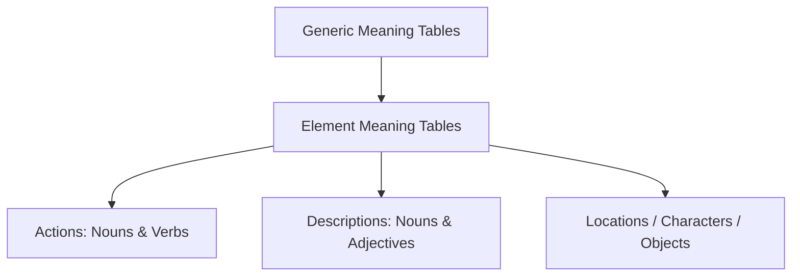

# Meaning Tables

**Meaning Tables** provide word prompts used to inspire interpretations of Random Events, Altered Scenes, NPC behaviors, and other narrative details. They consist of randomized pairings of **Action verbs** and **Subject nouns/Description adjectives**.

---

## 📖 Table Structure in the App

In the application, these tables are exported in `src/lib/constants.ts` as `EVENT_ACTIONS` and `EVENT_SUBJECTS`. 

### 1. EVENT_ACTIONS (Verbs)
*   **Total Elements:** 100
*   **Description:** High-level active verbs representing deeds, conflicts, and events.
*   **Duplicates Found in Code:**
    *   `Release` (appears twice)
    *   `Oppress` (appears twice)

### 2. EVENT_SUBJECTS (Nouns/Adjectives)
*   **Total Elements:** 100
*   **Description:** High-level themes, objects, or concepts to qualify the action.
*   **Duplicates Found in Code:**
    *   `Dispute` (appears twice)

---

## 🔄 Mythic GME 2e Meaning Table Expansion

In the **2nd Edition** rulebook (Pages 200–216), Tana Pigeon expanded the meaning tables into several specialized variations to make interpretations more specific.

### 1. Element Meaning Tables
Instead of rolling purely on generic verbs/nouns, 2e allows players to roll on specialized context lists:
- **Locations Meaning Table:** Words tailored to generating scenery, geography, and architecture (e.g. *ruined, subterranean, mechanical*).
- **Characters Meaning Table:** Words tailored to NPC identities and personalities (e.g. *vengeful, traveler, guardian*).
- **Objects Meaning Table:** Words tailored to items, loot, and physical evidence (e.g. *relic, weapon, correspondence*).

### 2. Implementation Note for Developers
To upgrade the app's oracle to GME 2e:
1.  Replace the duplicate entries in `EVENT_ACTIONS` and `EVENT_SUBJECTS`.
2.  Incorporate the 2e Element tables (Locations, Characters, Objects) as drop-down selections in the Event Generator UI.
3.  Instruct the AI Oracle (GPT) prompt to parse these specific element types when generating narrative flavor.

---

## 🔗 Connections
- [[index]] — Knowledge base map.
- [[random-events]] — How events use meaning tables.
- [[ai-oracle-prompting]] — Prompting LLMs with meaning table results.
