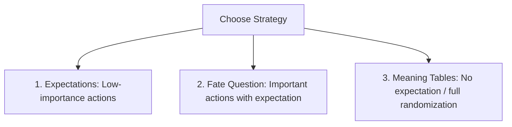

# NPC Behavior

In solo play, Non-Player Character (NPC) actions can be determined using a mix of expectations, Fate Questions, and random prompts.

---

## 🔄 Strategies for NPC Actions

When deciding what an NPC does or says, evaluate the situation in this order:

1.  **Expectations:** If you have a clear idea of what the NPC would logically do, and their action isn't crucial to the plot, simply run with your expectation.
2.  **Fate Questions:** If you have an expected action in mind, but it is important to the adventure, frame it as a Fate Question (e.g. *"Does the guard attack?"*). This adds uncertainty.
3.  **Meaning Tables:** If you have no idea what the NPC would do, roll a word pair on the Meaning Tables (Actions, Combat, or Conversations Element Tables) for inspiration.

---

## 📊 NPC Behavior Table

When a Fate Question is asked about an NPC's behavior (e.g., *"Does the NPC do X?"*), consult this table to interpret the result:

| Fate Question Result | Interpretation | Action to Take |
|---|---|---|
| **YES** | Expected Behavior | The NPC performs the expected action, or continues their ongoing action. |
| **NO** | Unexpected Behavior | The NPC does the *next most expected* action. If none is obvious, roll on a Meaning Table for inspiration. |
| **EXCEPTIONAL YES** | Intensified Expected Behavior | The NPC performs the expected action, but with **greater intensity** (e.g. charging recklessly instead of walking forward). |
| **EXCEPTIONAL NO** | Opposite / Intensified Alternate | The NPC either does the **exact opposite** of what you expected (e.g. fleeing instead of fighting) or performs the next most expected behavior with **extreme intensity**. |
| **RANDOM EVENT** | Additional Twist | Resolve the baseline Fate Question result, then roll on a Meaning Table to determine a **second, additional action** performed by the NPC (often resolving as a bluff or double-action). |

---

## 💬 Conversations & Social Skills

- **Overall Tone:** When NPCs talk, focus on their overall tone and target message rather than trying to script dialogue word-for-word. Generate the intent, then write the dialogue to match.
- **Social Skills Integration:** If your core RPG rules use social skills (e.g. *Persuasion, Intimidation*), roll those skills first. The outcome forms the new Context, guiding the Odds of subsequent Fate Questions and the interpretation of NPC reactions.

---

## 🔗 Connections
- [[index]] — Knowledge base map.
- [[fate-questions]] — Modifiers and mechanics for Fate checks.
- [[meaning-tables]] — Word prompts for NPC actions.
