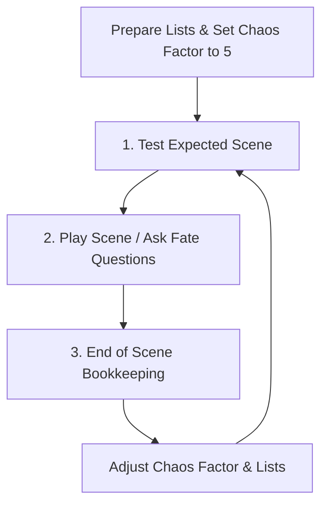

# Mythic GME 2nd Edition Rules Summary

The **Mythic Game Master Emulator (2nd Edition)** is a system that allows tabletop role-playing games to be played solo or cooperatively without a Game Master (GM). It functions by simulating GM decisions through an emulator logic engine based on expectations, probability checks, and random events.

## 🔄 The Game Loop

---

## 🎲 Core Concepts

### 1. Expectations vs. Fate Questions
*   **Follow Expectations:** When playing, if an outcome or detail matches your logical expectations for the setting, you simply establish it as fact.
*   **Test Expectations:** If a detail is critical, dramatic, or highly uncertain, frame it as a **Yes/No Question** and roll.

### 2. The Chaos Factor (1 to 9)
*   **Starting Value:** Always begins at **5**.
*   **Function:** Represents how out-of-control the situation is. High Chaos (6–9) makes "Yes" answers to Fate Questions more likely and increases the frequency of Random Events. Low Chaos (1–4) makes "No" answers more likely.
*   **Adjustment:** Modified at the end of each scene based on who was in control (PCs in control decreases Chaos; NPCs/events in control increases Chaos).

---

## 🔮 Resolving Fate Questions

Fate Questions are answered using a 1d100 roll against a probability threshold, or via a 2d10 Fate Check.

### Option A: The Fate Chart (1d100)
1.  **Formulate Question:** Ask a yes/no question.
2.  **Assign Odds:** Rate the probability of "Yes" from *Impossible* to *Certain* (9 standard odds levels).
3.  **Check Chart:** Cross-reference the assigned Odds with the current Chaos Factor to find the target numbers:
    *   **Yes:** Roll $\le$ Large Number.
    *   **Exceptional Yes:** Roll $\le$ Small Number on the left (usually 1/5th of Yes chance).
    *   **Exceptional No:** Roll $\ge$ Small Number on the right.
    *   **No:** Roll $>$ Large Number.
4.  **Random Event Trigger:** If you roll a double-digit number (11, 22, 33, 44, 55, 66, 77, 88, 99) and the single digit of that roll (1–9) is $\le$ current Chaos Factor, a **Random Event** triggers in addition to the answer.

### Option B: The Fate Check (2d10)
An alternative to the Fate Chart that doesn't require a reference table:
1.  **Assign Odds & Get Modifiers:** Translate Odds to a modifier (e.g. 50/50 is +0). Add the Chaos Factor modifier.
2.  **Roll 2d10 + Modifiers:**
    *   **Exceptional Yes:** Total $\ge$ 18
    *   **Yes:** Total $\ge$ 11
    *   **No:** Total $\le$ 10
    *   **Exceptional No:** Total $\le$ 4
3.  **Random Event Trigger:** If both dice roll the same number (e.g. double 3s) and that number is $\le$ current Chaos Factor, a **Random Event** triggers.

---

## ⚡ Random Events

Random Events introduce narrative twists.
1.  **Context:** Interpret the event relative to what is currently happening in the scene.
2.  **Event Focus:** Roll 1d100 on the **Random Event Focus Table** to see what the event is about (e.g. *Remote event*, *NPC action*, *Introduce a new NPC*, *Move toward a thread*).
3.  **Event Meaning:** Roll on the Meaning Tables (Actions / Descriptions / Elements) to get two inspirational words (e.g. "Attack / Ideas").
4.  **Synthesis:** Combine the Context, Focus, and Meaning words to interpret the event.

---

## 🎬 Scene Management

### 1. Scene Start (Expected vs. Altered/Interrupt)
1.  **Determine Expected Scene:** State what you expect to happen next.
2.  **Roll 1d10 against Chaos Factor:**
    *   If roll $>$ Chaos Factor: The scene plays out as **Expected** (Unmodified).
    *   If roll $\le$ Chaos Factor and is **Odd** (1, 3, 5, 7, 9): The scene is **Altered** (tweak elements, change expectations).
    *   If roll $\le$ Chaos Factor and is **Even** (2, 4, 6, 8): The scene is **Interrupted** (generate a Random Event to start the scene).

### 2. Active Lists
*   **Characters List:** NPCs, companions, and factions active in the adventure.
*   **Threads List:** Open quests, plotlines, and goals.
*   *Note: Lists act as dynamic random tables during Random Events.*

### 3. End of Scene Bookkeeping
1.  **Update Lists:**
    *   Add new Threads/NPCs that became important.
    *   If a Character or Thread was highly relevant, add them again (max 3 times on the list to increase their weight).
    *   Remove completed Threads and deceased/irrelevant Characters.
2.  **Adjust Chaos Factor:**
    *   If PC was in control: Chaos Factor $-1$ (minimum 1).
    *   If PC was not in control: Chaos Factor $+1$ (maximum 9).

---

## 🔗 Connections
- [[index]] — Knowledge base map.
- [[fate-questions]] — Detailed Fate resolution rules.
- [[chaos-factor]] — Detailed Chaos mechanics.
- [[random-events]] — Focus tables and meaning mechanics.
- [[scenes]] — Detailed scene progression mechanics.
