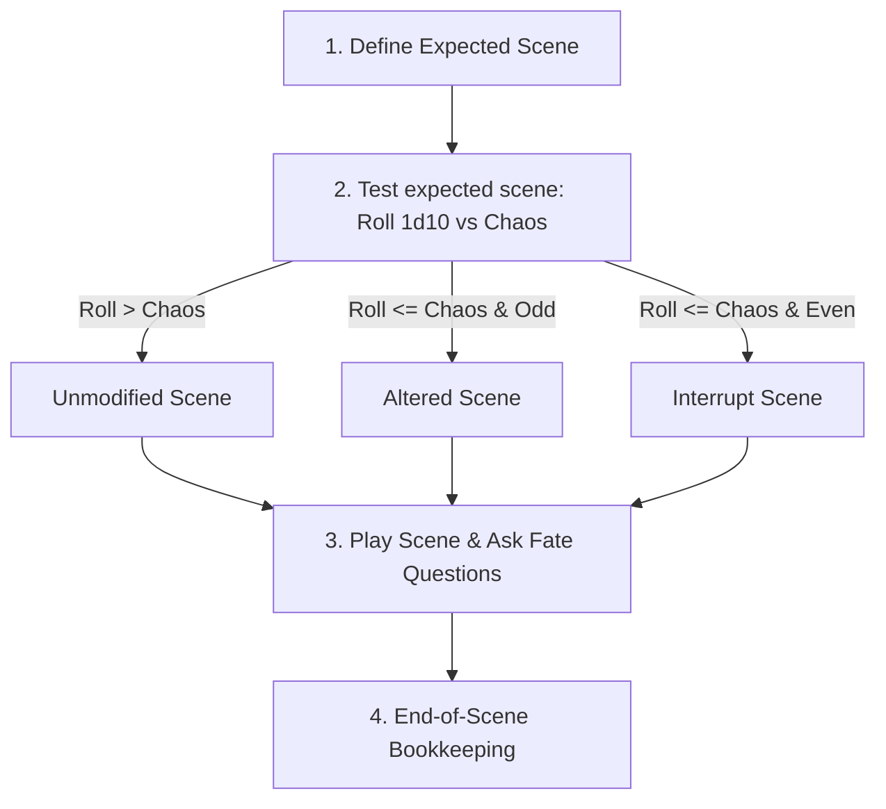

# Scenes

In Mythic GME, the story is broken down into sequential **Scenes**. Scenes provide structure to solo play, determining how the narrative progresses, what threats appear, and when bookkeeping happens.

---

## 🔄 The Scene Lifecycle

For every scene, follow these four phases:

---

## 🎬 Testing the Scene

Before a scene begins, state the **Expected Scene** (what you logically think will happen next based on recent events). Then roll **1d10** against the current **Chaos Factor**:

### 1. Unmodified (Expected) Scene
- **Trigger:** Roll is **greater** than the current Chaos Factor.
- **Outcome:** The scene begins exactly as you expected.

### 2. Altered Scene
- **Trigger:** Roll is **equal to or less** than the current Chaos Factor **and is ODD** (1, 3, 5, 7, 9).
- **Outcome:** The scene is modified. Choose a modification method:
  - **The Next Expectation:** Play out the next most logical thing you would expect.
  - **A Tweak:** Change one minor detail.
  - **Fate Question:** Ask a yes/no question to test if a specific change occurs.
  - **Meaning Tables:** Roll on the Action/Description tables for inspiration.
  - **Scene Adjustment Table:** Roll **1d10** to determine what category of element changes.

#### Scene Adjustment Table

| Roll (1d10) | Result | Action |
|---|---|---|
| **1** | Remove A Character | Remove the most logical NPC from the scene. |
| **2** | Add A Character | Select a random NPC from the Characters List and add them. |
| **3** | Reduce/Remove An Activity | Lower the intensity of an active threat or event. |
| **4** | Increase An Activity | Intensify an ongoing threat, chase, or active event. |
| **5** | Remove An Object | Remove a key item, tool, or environmental feature. |
| **6** | Add An Object | Introduce a significant item or environmental detail. |
| **7–10** | Make 2 Adjustments | Roll twice on this table, combining the results. |

### 3. Interrupt Scene
- **Trigger:** Roll is **equal to or less** than the current Chaos Factor **and is EVEN** (2, 4, 6, 8).
- **Outcome:** An unexpected event cuts off your expected scene. Immediately generate a **Random Event** (roll Focus + Meaning) and use that event as the start of the scene.

---

## 📚 End of Scene Bookkeeping

When the scene concludes (reaches a logical narrative pause, change in location, or shift in mood), perform these steps:

### 1. Update the Lists
- **Characters List:** Add new NPCs encountered. If an NPC was highly important, you can add them again (up to a **maximum of 3 times** on the active list) to increase their probability weight. Remove NPCs who are dead or no longer relevant.
- **Threads List:** Add new plotlines, quests, or mysteries. If a thread is highly active, add it up to **3 times** to weight it. Remove threads that are resolved.

### 2. Adjust the Chaos Factor
Evaluate the Player Characters' level of control during the scene:
- **PC in Control:** Decrease Chaos Factor by **1** (minimum limit: 1).
- **PC Not in Control:** Increase Chaos Factor by **1** (maximum limit: 9).

---

## 🔗 Connections
- [[index]] — Knowledge base map.
- [[chaos-factor]] — How Chaos affects scene tests.
- [[random-events]] — Generating Interrupt events.
